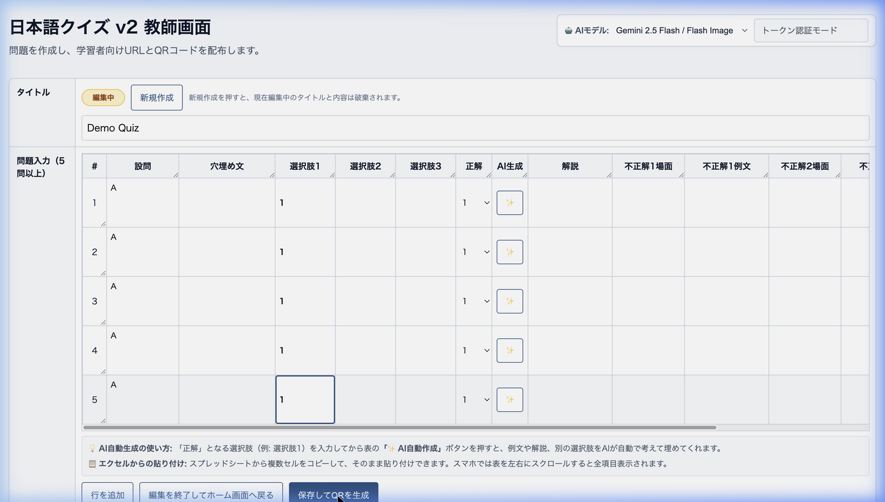
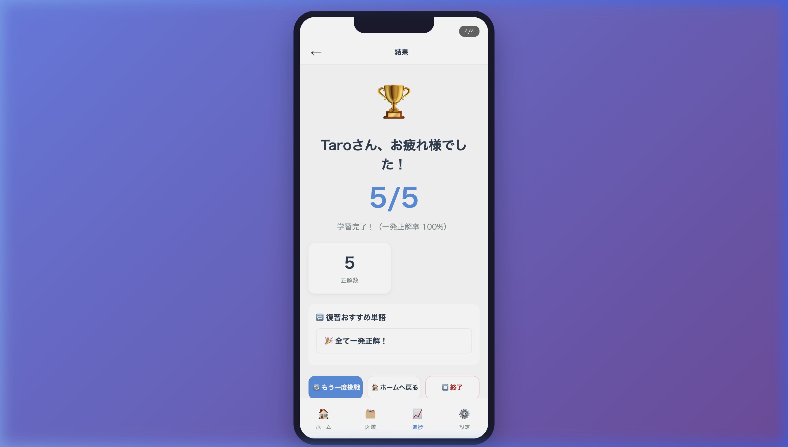
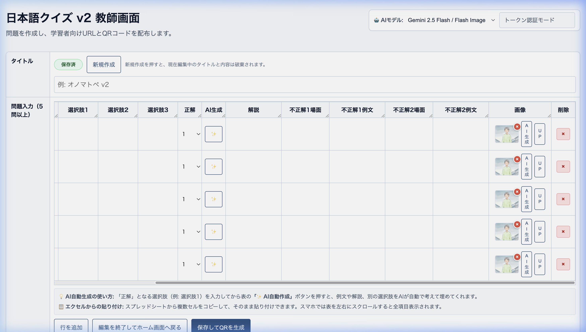
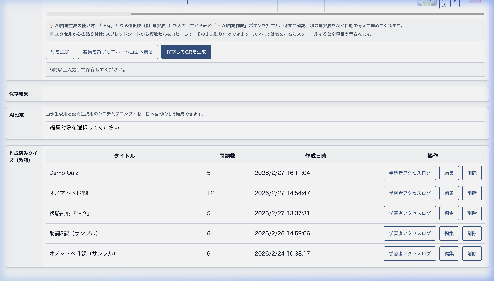
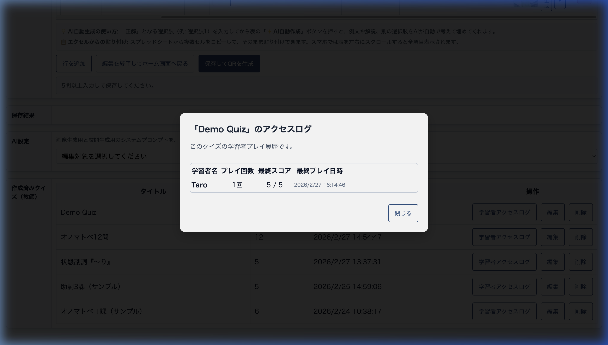

# 日本語クイズ v2 教師・管理者向け運用マニュアル

本ドキュメントは、日本語クイズ v2 を利用してクイズを作成・配布・管理する教師（Teacher）およびシステム管理者（Admin）向けの操作説明書です。画面操作の流れを動画と図解で解説します。

---

## 1. アカウント権限について

| 権限種別 | 役割説明 |
| --- | --- |
| **Admin (= Owner)** | ユーザー管理権限（Teacherの追加・削除）、システム全体の設定 |
| **Teacher (= User)** | クイズの作成、編集、削除、学習者への配布 |
| **Student** | クイズの受験のみ（ログイン不要） |

> [!NOTE]
> 管理画面へのアクセスは Googleアカウント によるログインが必要です。  
> Teacherアカウントの追加は Admin アカウントからのみ可能です。

---

## 2. 教師画面へのログイン方法

1. トップページの **「Teacher / User・Admin / Ownerはこちら」** ボタンをクリックします。
2. アカウントとして登録されているGoogleアカウントを選択し、ログインします。（通常 `/teacher-login` を経由）
3. Teacherは自分のダッシュボード（管理画面）へ、Adminは「Teacher画面」または「Admin管理画面」を選択して遷移します。

> [!IMPORTANT]
> 「Google認証の設定が未完了です」というエラーが出た場合は、管理者が許可したGoogleアカウントではない可能性があります。システム管理者にお問い合わせください。

---

## 3. クイズの作成とQRコード配布の流れ

学習者向けのクイズ作成は、管理画面から1ページで行うことができます。

*動画: ダッシュボードでのクイズ作成からQRコード生成までの一連の流れ*

### 🖋️ クイズ入力手順

*図1: クイズ作成画面（5問以上の入力が必要です）*

1. **画面を開く**: 管理画面の上部にある **「＋新規作成」** ボタンを押します。
2. **タイトル入力**: 今回作成するクイズのタイトルを入力します。
3. **設問の作成**: 最低5問以上の問題を入力します。各問題には以下の入力が必須です。
   * 『穴埋め文 / 設問の内容』
   * 『正解となる選択肢1』
   * 『誤答となる選択肢2、選択肢3』
   * 『解説』
4. **QRコード生成**: 全ての入力が終わったら、画面最下部にある **「保存してQRを生成」** をクリックします。

> [!TIP]
> **✨ AI自動生成の活用:**
> 「正解」となる選択肢（選択肢1）だけを入力し、「AI自動作成」ボタンを押すと、例文や誤答選択肢、解説をAIが自動で考えて埋めてくれます。クイズ作成の大幅な時短になります。

### 📲 配布方法

保存が完了すると、画面の「保存結果」エリアに **学習者専用のURL** と **QRコード** が表示されます。
このQRコードやURLをスクリーンに映すか、チャット等で学習者へ送信して受講を促してください。

---

## 4. 学習者（Student）の受講フロー

学習者がQRコードを読み取った後の、実際の受講フローです。

*動画: 学習者が名前を入力し、クイズに解答するまでの流れ*

1. **アクセス**: 学習者がQRコード（または専用URL）を読み取ると、クイズのトップ画面が開きます。
2. **氏名入力**: 「お名前（ニックネーム）」を入力し、**「▶️ クイズを始める」** をタップします。
3. **クイズ解答**: 問題が順番に表示されますので、正解と思う選択肢を選び **「▶️ 次の問題へ」** を進めます。
4. **結果発表**: 全問解答し終わるとスコア結果画面が表示されます。

*図2: 学習者のクイズスコア結果画面・解説の確認*

---

## 5. アプリケーションの高度な機能（画像・再利用・ログ）

### 🖼️ 画像の生成とアップロード機能
各設問に対して、AIを用いた画像生成やお手持ちの画像のアップロードが可能です。

*図3: 各問題行の右端にある「AI生成」「UP」ボタン*

1. **AIで画像を生成する**:
   * 対象の行で `AI生成` ボタンをクリックします。
   * 現在の設問（穴埋め文や正解）を元に、自動で画像が生成されます。
   * *※ すでに画像がある場合は、プロンプト入力画面が表示され、「猫を白猫にして」などの追加の要望を指定して再生成できます。*
2. **画像をアップロードする**:
   * 対象の行で `UP` ボタンをクリックし、パソコンやスマホ内の画像を選択します。
   * **画像サイズとアスペクト比**: アップロードされた画像は自動的に **4:3 の比率** にトリミング（またはリサイズ）されます。あらかじめ 4:3 に近い画像をご用意いただくと綺麗に表示されます（一般的な画像フォーマット PNG, JPEG 等に対応）。

### 🔄 過去に作成したクイズの再利用
過去に作成したクイズは、ダッシュボード下部の **「作成済みクイズ（教師）」** リストに一覧表示されます。

*図4: ダッシュボード下部の作成済みクイズ一覧*

* **再編集・使い回し**: リスト内の `編集` ボタンを押すと、過去のクイズデータが入力フォームに展開されます。タイトルや設問を少し変更して新しいクイズとして使い回す（別QRコードにする）ことが簡単にできます。
* *※「新規作成」ボタンを押すことで、現在編集中の状態をリセットし、フォームを白紙に戻すことができます。*

### 📊 学習者アクセスログの確認
過去のクイズの「作成済みクイズ（教師）」リストから、各クイズの参加状況を確認できます。

*図5: 学習者アクセスログの確認画面*

* **操作方法**: 各クイズ行にある `ログ`（学習者アクセスログ）ボタンをクリックします。
* **確認できる内容**: そのクイズにアクセスした学習者の情報が一覧表示されます。
  1. **学習者名** (ニックネーム)
  2. **プレイ回数** (何度そのクイズに挑戦したか)
  3. **最終スコア** (最後に受けた際の点数)
  4. **最終プレイ日時**

---

## 6. よくあるトラブルシューティング

* **Q: 学習者がクイズを開始できません。**
  * A: 学習者が、直接アプリのトップページURL（ルートURL）にアクセスしている可能性があります。学習者は必ず**教師が生成したQRコードや専用クイズURL（`/quiz/xxxxxx`）** からアクセスする必要があります。

* **Q: クイズ情報をExcelから一括でコピーしたいです。**
  * A: スプレッドシート等で表を作っておき、複数セルをコピーして、入力画面のセルにそのまま貼り付ける（ペースト）ことが可能です。

* **Q: AIの画像生成・設問生成結果があまり良くないです。**
  * A: 管理画面下部にある **「AI設定」** セクションにて、AIへ送る「システムプロンプト」を直接編集できます。ここで要望を細かく指定して保存すると、次回のAI生成から即座に反映されます。

---
*最終更新日: 2026-02-27*
